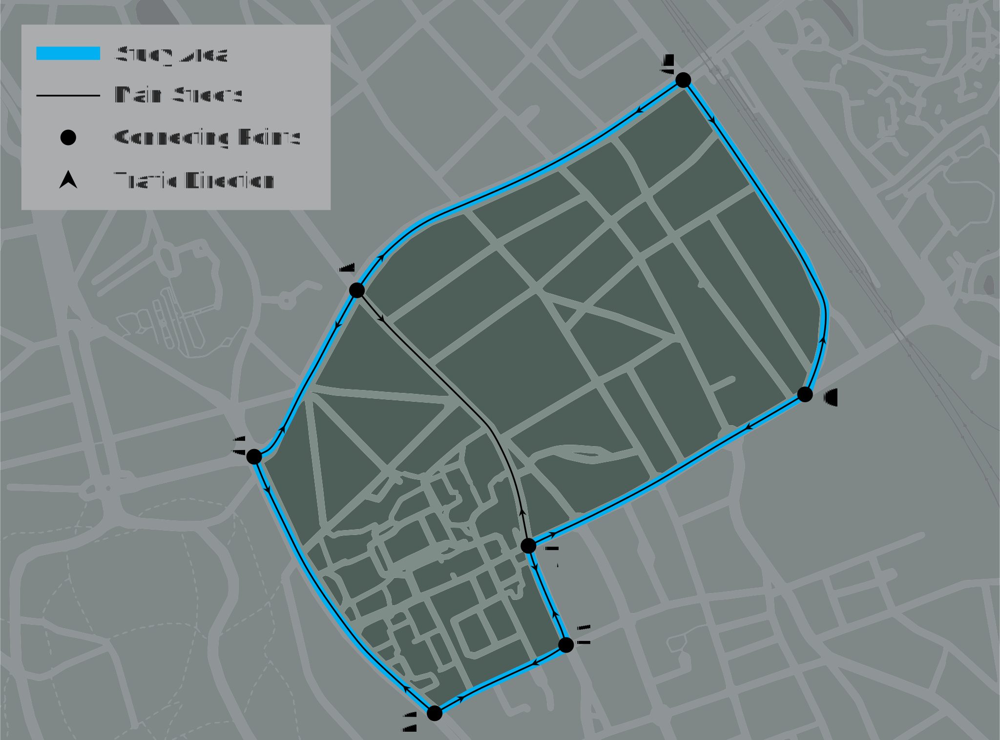
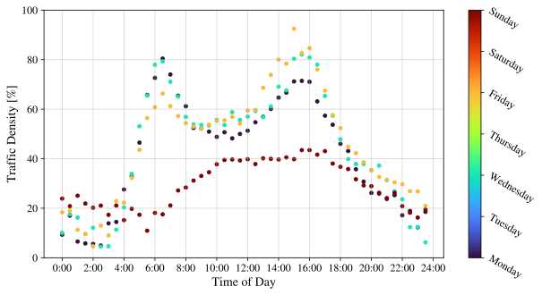

# Ixelles Traffic Data
SPICECO project traffic **density** data scraped from Google Maps for  Ixelles, Brussels (between ULB-Solbosch and VUB-Etterbeek campuses). Area of interest ~0.75 $km^{2}$.

The data regard **density** of traffic and NOT actual traffic counts. They were acquired following the formula:

$D = \frac{dT_{A \rightarrow B}(t)}{dT_{A \rightarrow B,avg}}$

These can be mostly used for scaling known/approximated pollutant sources for pollutant dispersion studies. Example plot of the data can be sen below:\

Streets of interest include:
* Av. Franklin Roosevelt
* Blv. General Jacques
* Av. de la Couronne
* Av. de l' Université
* Av. Adolphe Buyl

## Required packages
The SensorData_Request.ipynb file needs the following packages:
* numpy
* pandas
* datetime
* requests

## Data sources
The included data have been acquired from the Google Maps API **(see TrafficData_Request.ipynb)** and include traffic densities for all possible combinations of points 1-7 **(see the map above)**. The were extracted for different weeks of the year (1-52), day of the week (1-7) and hour of the day (0-24) with a sampling rate of 30 minutes.

## Data formats and units

All acquired data have the following format/units:

|      **Quantity**      |                 **Format/Range**                |
|------------------------|-------------------------------------------------|
| timestamp              | YYYY-MM-DD HHMMSS                               |
| yday                   | [1-365]                                         |
| wday                   | [1-7]                                           |
| hmin                   | [0-23.5]                                        |
| dmin                   | [0-1410]                                        |
